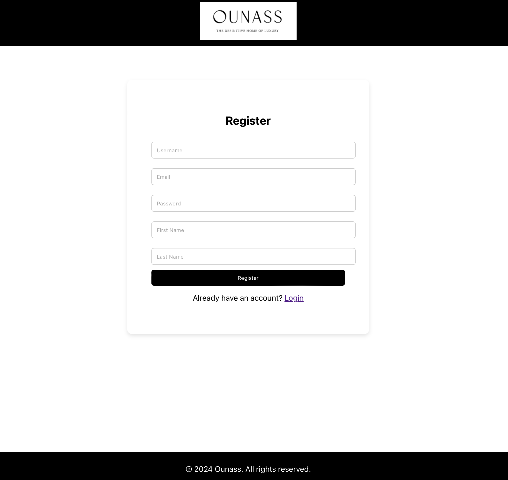
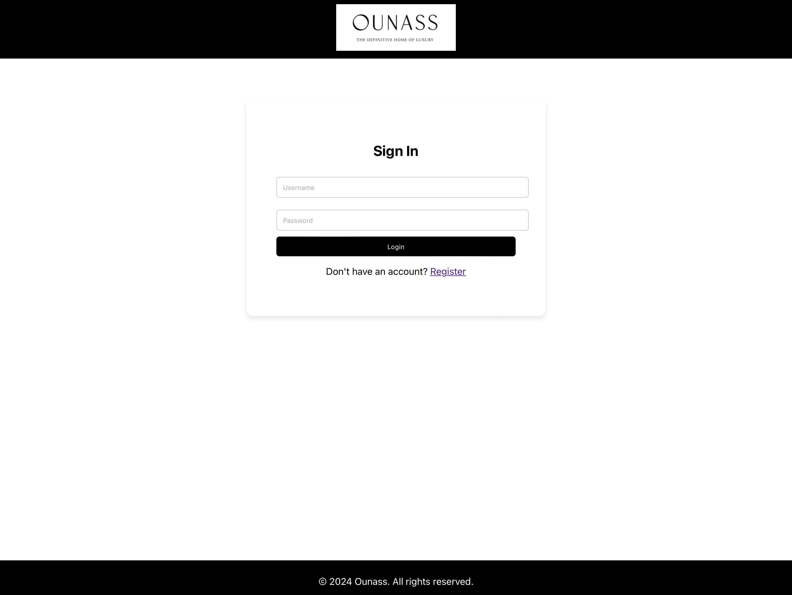
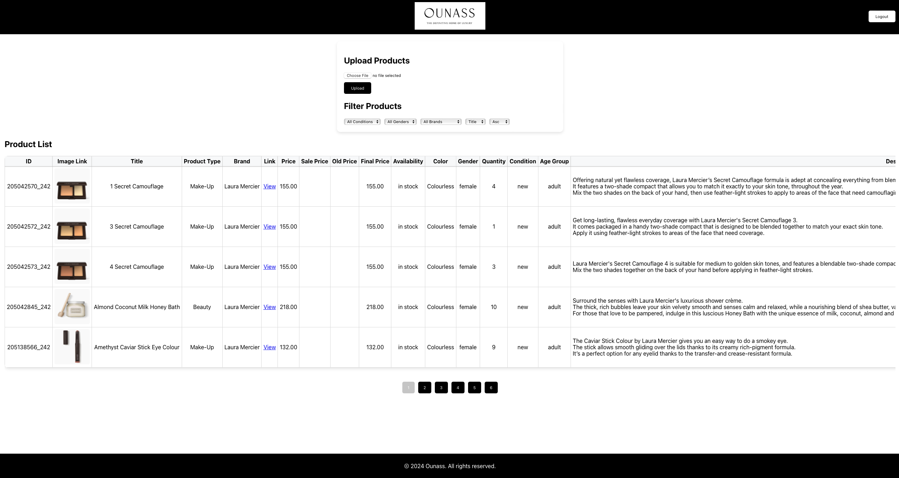

# Product Management Service

This is a full-stack application built for managing product uploads and viewing product listings. The project is composed of a React.js frontend and a Django backend with RESTful API support. The backend handles user authentication, product management, and background tasks using Dramatiq and PostgreSQL as the database. The project is fully containerized using Docker and orchestrated with Docker Compose.

## Key Technologies Used

```text
React.js: The frontend for the product management UI.
Django: The backend framework for handling API requests.
PostgreSQL: Database for storing product and user information.
Redis: In-memory data structure store for Dramatiq task queuing.
Dramatiq: Task queue to handle background processes like sending notifications.
Docker: Containerization tool to run the entire application.
Docker Compose: Tool to manage multi-container Docker applications.
```

## Project Structure

```text
ProductManagementService/
│
├── backend/                    # Django-based backend service
│   ├── products/               # Products app containing models, views, tasks, etc.
│   └── product_management/     # Main Django project directory
│
├── frontend/                   # React.js frontend service
│   ├── src/                    # Source files for the React.js app
│
├── docker-compose.yml           # Docker Compose configuration
├── README.md                    # Project documentation
└── .venv/                       # Virtual environment (optional if using Docker)
```

## Features

#### [Frontend](frontend)
User Authentication: Users can register, log in, and log out.
Product Listing: Users can view paginated, filtered, and sorted product listings.
Product Upload: Users can upload products via an XML file.
#### [Backend](backend)
User Management: User registration and authentication with token-based JWT.
Product Management: Upload, list, and filter products via RESTful APIs.
Background Tasks: Asynchronous task queue using Dramatiq to send notification emails to admins after product uploads.

### Setup Instructions

#### Step 1: Clone the Repository
Clone the repository to your local machine:
```bash
git clone https://github.com/msenay/ProductManagementService.git
cd ProductManagementService
```
#### Step 2: Setup Environment Variables
Both the frontend and backend require environment variables for configuration. These variables are defined in .env.template files located in the respective directories.You can do it manually or via terminal commands like above.

##### Backend Setup:
Copy the [.env.template](backend/.env.template) to backend/.env:
```bash
cp backend/.env.template backend/.env
```
Modify the backend/.env file to add the correct values for database connection, Redis, email settings, and API configuration.

#### ! Please change here in order to get email. This will create an admin user for you. ! so you get notify when a product is uploaded. !
```env
DJANGO_ADMIN_USERNAME=<DJANGO_ADMIN_USERNAME>
DJANGO_ADMIN_EMAIL=<DJANGO_ADMIN_EMAIL>
DJANGO_ADMIN_PASSWORD=<DJANGO_ADMIN_PASSWORD>
```
##### Frontend Setup:
Copy the [.env.template](frontend/.env.template) to frontend/.env:
```bash
cp frontend/.env.template frontend/.env
```
Modify the frontend/.env file to include the API URL for your backend.

#### Step 3: Running the Application Using Docker Compose
The project is configured with Docker Compose to simplify running the entire application, including the frontend, backend, PostgreSQL, Redis, and Dramatiq worker. You can start the entire stack by running the following command:

```bash
docker-compose up --build
```
#### Step 4: Accessing the Services
Once Docker Compose finishes building and starting the containers, you can access the services:

##### Frontend:
Open your browser and go to [http://localhost:3000](http://localhost:3000).

Frontend has its own [README.md](frontend/README.md) file so you can check it in frontend directory.

##### Backend API:
Access the API at [http://localhost:8000](http://localhost:8000).
For example, the product listing endpoint is available at [http://localhost:8000/list-products/](http://localhost:8000/list-products/).

Backend has its own [README.md](backend/README.md) file so you can check it in the Backend directory.

##### Docker Compose Configuration
The docker-compose.yml file manages all the services needed for the project:

```yaml
version: '3.8'

services:
  db:
    image: postgres:latest
    container_name: db_postgres
    env_file:
      - ./backend/.env
    volumes:
      - postgres_data:/var/lib/postgresql/data
    ports:
      - "${POSTGRES_PORT:-5432}:${POSTGRES_PORT:-5432}"
    restart: always

  api:
    build:
      context: ./backend
      dockerfile: Dockerfile
    command: ./run_api
    container_name: api
    env_file:
      - ./backend/.env
    volumes:
      - ./backend:/app
    ports:
      - "${API_PORT:-8000}:${API_PORT:-8000}"
    depends_on:
      - db
    restart: always

  redis:
    image: redis:alpine
    command: redis-server --loglevel warning
    restart: always
    ports:
      - "${REDIS_PORT:-6379}:${REDIS_PORT:-6379}"
    volumes:
      - redis_data:/data

  dramatiq:
    container_name: dramatiq
    build:
      context: ./backend
    command: dramatiq products.tasks.tasks --threads 1 --queues default --path /app
    restart: always
    env_file:
      - ./backend/.env
    volumes:
      - ./backend:/app
    depends_on:
      - db
      - redis

  frontend:
    build:
      context: ./frontend
      dockerfile: Dockerfile
    container_name: frontend
    restart: always
    env_file:
      - ./frontend/.env
    ports:
      - "${REACT_APP_PORT:-3000}:${REACT_APP_PORT:-3000}"
    depends_on:
      - api
      - dramatiq
      - redis
      - db

volumes:
  postgres_data:
  redis_data:
```

##### Key Services in Docker Compose:
```text
PostgreSQL (db): Stores user and product data.
Backend API (api): The Django application that provides API endpoints for the frontend.
Redis: Used as the message broker for the Dramatiq task queue.
Dramatiq Worker (dramatiq): Processes background tasks like sending email notifications.
Frontend: The React.js application that communicates with the backend.
```

####  Step 5: Testing
A Postman collection is provided in the root directory [postman_collection.json](backend/Ounass_Case_Study.postman_collection.json) for testing the APIs. You can import this collection into Postman and use it to test the various API endpoints.
Open Postman. Import the collection by going to File > Import and selecting Ounass Case Study.postman_collection.json.

<p>Backend Unit Tests: They will run automatically with docker-compose up --build. Please check backend/run_api script.</p>

#### [run_api](backend/run_api) Script Explanation:
```text

This Bash script automates the database migration, admin user creation, testing, and starting the Django development server. Here's what each step does:

Make Migrations:
The script first generates migration files for the products app by running python manage.py makemigrations products. This ensures that any changes in the models are reflected in migration files.
Apply Migrations:
The script then applies any pending migrations to the database with python manage.py migrate --noinput. This step sets up the database schema based on the models.
Check for Admin User:
The script checks if an admin (superuser) already exists in the database. If no admin exists, it creates a new admin user using the DJANGO_ADMIN_USERNAME, DJANGO_ADMIN_EMAIL, and DJANGO_ADMIN_PASSWORD environment variables. This is useful for testing purposes or setting up the first admin user.
Run Tests:
Before starting the server, the script runs the Django tests using python manage.py test. If any tests fail, the script exits and prevents the server from starting to ensure only properly functioning code is deployed.
Start the Django Server:
If all tests pass, the script starts the Django development server, listening on all interfaces (0.0.0.0) at port 8000.
```

####  Step 6: Stopping the Services
To stop the running containers, use the following command:

```bash
docker-compose down
```

### Project Screenshots
<h3>Register Page</h3>

<h3>Signin Page</h3>

<h3>Products Page</h3>


### Conclusion

This project is fully containerized and managed via Docker Compose, allowing seamless integration between the frontend, backend, and services like PostgreSQL, Redis, and Dramatiq. Ensure you have the correct .env files for both frontend and backend before starting the application.